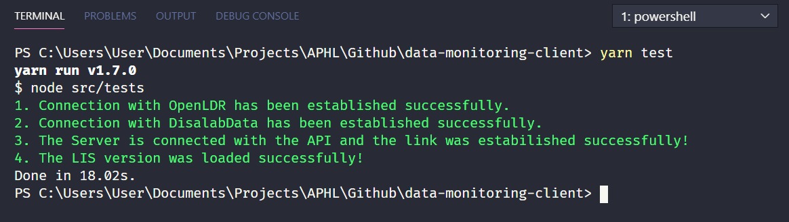
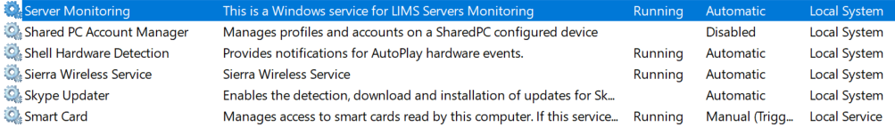

## LIS Server monitoring tool (client)

**Requisitos para a instalação**

- Node Js (LTS)
- Yarn Package Manager
- Habilitar o acesso externo do SQL Server

**Instalação das dependências**

1. Instalar o gestor de pacotes Yarn
2. Instalar o Node Js na sua versão LTS e configurar as variáveis de ambiente

**Deployment do client**
Uma vez instaladas as dependências é de seguida feito o deployment da aplicação, bastando apenas clonar o projecto usando o git.
`git clone https://github.com/Association-of-Public-Health-Labs/data-monitoring-client.git`

**Teste da aplicação**
Para testar a aplicação deve-se executar o comando `yarn test` na raíz do projecto.
Se tudo correr conforme o desejado, o output do console será o seguinte:

**Executar a aplicação**

Para executar a aplicação basta executar o comando `yarn run:service` na raíz do projecto e será criado um Windows service denominado `Server Monitoring`, conforme a imagem abaixo.

